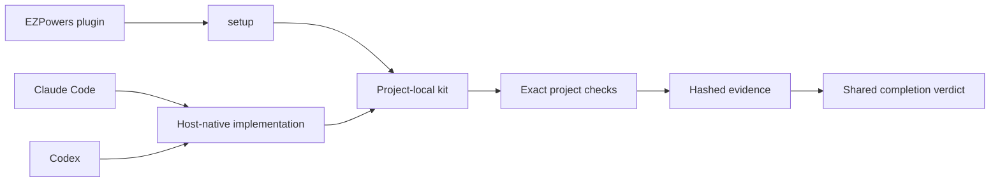

# EZPowers

> Claude Code와 Codex가 같은 저장소 증거로 작업의 **완료 여부**를
> 판단하도록 만드는 프로젝트 로컬 워크플로 플러그인입니다.

**Plugin v5.5.0 · Project kit v5.5.0 · Python 3.10+ · MIT**

[빠른 시작](#빠른-시작) · [워크플로](#기본-워크플로) ·
[스킬 목록](#스킬-목록) · [업데이트](#업데이트) ·
[전체 문서](docs/INDEX.md) · [한국어 스킬 가이드](docs/ezpowers-skills-guide.html)

EZPowers는 또 하나의 코딩 에이전트가 아닙니다. 코드 편집, 셸 실행,
서브에이전트, 워크트리와 리뷰는 Claude Code 또는 Codex가 담당합니다.
EZPowers는 저장소 안에 문서, 명세, 계획, 실제 검증 명령, 해시된 실행
증거와 재개 상태를 남기고 두 호스트에 같은 완료 판정을 제공합니다.

## 왜 EZPowers인가

| 흔한 문제 | EZPowers가 제공하는 것 |
| --- | --- |
| 세션이 바뀌면 프로젝트 맥락이 사라짐 | 저장소 근거로 관리되는 문서 그래프와 로컬 wiki |
| “테스트가 통과했다”는 설명만 남음 | exact-argv 명령의 실제 stdout/stderr, 종료 코드와 SHA-256 증거 |
| 결과 설명이 장황하거나 근거 없는 서사로 흐름 | 대화 언어를 따르고 관찰된 근거만 쓰는 `explain-with-evidence` |
| 요구사항과 구현 계획의 연결이 끊김 | acceptance criterion → task → check 추적 |
| Claude Code와 Codex의 완료 기준이 달라짐 | 동일한 프로젝트 키트와 host-independent PASS/FAIL 판정 |
| 자동 실행이 검증이나 리뷰를 건너뜀 | 명시적 승인과 한도가 있는 `harness-chain` |
| 가설로 먼저 패치해 실제 버그를 놓침 | exact-red 재현 전에는 가설·제품 수정을 금지하는 `diagnose` |
| UI 유지보수 중 토큰과 구현이 어긋남 | UX 문서와 가까운 `DESIGN.md`를 함께 검증하는 오프라인 디자인 계약 |



## 빠른 시작

### 1. 사전 요구사항

- Git worktree 루트인 대상 프로젝트
- Python 3.10 이상
- Claude Code 또는 Codex
- 선택 기능의 최소 버전:
  Claude Code 2.1.217+, Codex CLI 0.145.0+

기본 프로젝트 키트 설치 자체는 호스트 hook을 요구하지 않습니다. 위 호스트
최소 버전은 completion hook, wiki capture, `harness-chain`, Codex HUD처럼
호스트별 설정을 활성화할 때 검사됩니다.

### 2. 플러그인 설치

#### Claude Code

```bash
claude plugin marketplace add dlwlgus9125/EZPowers
claude plugin install ezpowers@ezpowers-dev
```

설치한 세션에서 바로 반영하려면 `/reload-plugins`를 실행하거나 새 세션을
시작합니다.

#### Codex

```bash
codex plugin marketplace add dlwlgus9125/EZPowers --ref main
codex plugin add ezpowers@ezpowers-dev
```

플러그인 설치 후 대상 저장소에서 새 Codex 세션을 시작합니다.

> 플러그인 설치는 전역 marketplace에 플러그인을 등록하는 단계입니다.
> 대상 저장소에는 아직 파일을 쓰지 않습니다.

### 3. 대상 프로젝트 설정

대상 저장소 루트에서 setup 스킬을 명시적으로 호출합니다.

| 호스트 | 호출 |
| --- | --- |
| Claude Code | `/ezpowers:setup` |
| Codex | `$ezpowers:setup` |

`setup`은 저장소의 테스트·빌드·lint 명령과 기존 문서를 먼저 조사한 뒤
자급형 프로젝트 키트를 설치합니다. documentation bootstrap은
preview/apply/lint 순서로 진행되며, 관리되지 않은 기존 문서는 명시적 채택
없이 덮어쓰지 않습니다.

기본값으로 completion hook과 SessionEnd wiki capture는 설치되지 않습니다.
각 기능은 별도 요청과 승인이 필요합니다.

## 두 개의 설치 계층

| 계층 | 역할 | 포함 범위 |
| --- | --- | --- |
| EZPowers 플러그인 | 어느 저장소에서든 namespaced 스킬 제공 | 14개 스킬, 플러그인 메타데이터 |
| 프로젝트 로컬 키트 | 저장소가 독립적으로 검증·재개 가능하게 함 | 13개 스킬, 11개 계약, 런타임, 3개 도구 |

프로젝트 키트가 설치되면 핵심 파일은 다음 위치에 생깁니다.

```text
.ezpowers/
  ezpowers.py
  config.json
  state.json
  ledger.json
  kit/manifest.json
  contracts/
  tools/
.claude/skills/   # Claude Code용 프로젝트 스킬
.agents/skills/   # Codex용 프로젝트 스킬
```

`hud`는 전역 Codex UI 설정을 다루므로 프로젝트 키트에는 설치되지 않습니다.

## 기본 워크플로

```text
setup -> documentation preview/apply/lint
      -> deep-interview       (요청이 모호하거나 중요한 사각지대가 의심될 때)
      -> design-architecture  (기술 경계가 미정일 때)
      -> spec -> prepare-execute -> execute
```

일반적인 기능 작업은 호스트가 구현하고 프로젝트 로컬 런타임이 검증과
인증을 담당합니다.

```text
settled intent
  -> acceptance criteria
  -> criterion-covered plan
  -> host-native implementation
  -> exact project checks
  -> hashed evidence
  -> certification
```

장시간 무인 실행이 실제로 필요한 경우에만 별도 흐름을 명시적으로
활성화합니다.

```text
harness-chain configure
  -> feature preview
  -> independent oracle audit
  -> one feature approval
  -> host-native loop
  -> verify
  -> independent review / conditional QA
  -> certify
```

`harness-chain`은 기본적으로 비활성입니다. 승인된 acceptance input과 한도를
고정하지만, 자체 코딩 에이전트나 외부 executor가 되지는 않습니다.

## 스킬 목록

플러그인 호출 형식은 Claude Code에서 `/ezpowers:<name>`, Codex에서
`$ezpowers:<name>`입니다. 프로젝트 로컬 복사본은 각각 `/name`, `$name`
형식으로 사용할 수 있습니다.

| 스킬 | 언제 사용하는가 | 결과와 경계 |
| --- | --- | --- |
| `setup` | 설치, 복구, refresh, 문서 bootstrap | 프로젝트 키트를 설치하고 실제 검증 명령을 등록 |
| `deep-interview` | 요청이 모호하거나 숨은 전제까지 점검해야 할 때 | 중요한 사각지대만 한 질문씩 확인해 세션 안에서 요청을 확정; 파일이나 구현 권한은 만들지 않음 |
| `explain-with-evidence` | 작업 결과·기술 판단·개념을 사용자에게 설명할 때 | 현재 대화 언어와 실측 근거를 따르며 고정 형식과 완료 판정은 바꾸지 않음 |
| `diagnose` | 버그, 실패한 테스트·빌드, flaky·성능 문제 | exact-red → 최소화 뒤에만 가설을 쓰고 source-cause fix와 원증상 검증까지 완료 |
| `codebase-design` | 한 모듈의 interface·seam·테스트 구조를 설계할 때 | 집중 설계 조언; 전체 코드베이스 스캔이나 구현은 하지 않음 |
| `improve-codebase-architecture` | 기존 제품 코드의 구조 개선 후보를 넓게 찾을 때 | 실제 file/line·결정 맥락에 결속된 offline 보고서 후, 선택한 한 후보만 설계하고 구현하지 않음 |
| `design-architecture` | 영속적인 경계·data flow·deployment 결정이 필요할 때 | spec 전에 추적 가능한 architecture 결정을 기록 |
| `spec` | 결정된 요구를 검증 가능한 기준으로 고정할 때 | traceable acceptance contract 생성 |
| `prepare-execute` | spec을 구현 순서와 정확한 검사로 변환할 때 | 모든 criterion을 덮는 plan 생성; 구현은 하지 않음 |
| `execute` | 검증된 plan을 구현할 때 | 호스트가 구현하고 EZPowers가 verify/certify |
| `frontend-design` | UI·UX·responsive·accessibility 결정을 먼저 정할 때 | 넓은 UX 문서와 토큰 권위인 `DESIGN.md`를 짝으로 정리 |
| `wiki` | 로컬 지식을 저장·검색·승격·정리할 때 | 보조 기억만 관리; 저장소 근거나 완료 권한을 대체하지 않음 |
| `harness-chain` | 승인된 기능을 한도 내에서 무인 실행할 때 | 독립 oracle/review/QA와 terminal limit을 결합; 명시 호출 전에는 비활성 |
| `hud` | 전역 Codex model·usage statusline을 관리할 때 | plugin-only 전역 유틸리티; 프로젝트 harness와 분리 |

### `diagnose`의 완료 기준

명시적인 `diagnose`, fix, debug 요청은 `FIX-COMPLETE`로 동작합니다.
root cause, failing regression test, 첫 targeted green은 중간 진행 상황일 뿐입니다.
다만 사용자의 정확한 증상을 검출하는 명령을 실제로 red로 실행하기 전에는
가설, root-cause 주장, fix 제안, 제품 동작 변경을 할 수 없습니다. 재현할 수
없으면 필요한 접근권한·capture·instrumentation을 구체적으로 요청하고
추측 수정 없이 멈춥니다.

완료하려면 다음 조건을 충족해야 합니다.

1. 사용자의 정확한 원래 증상을 명령으로 실행해 red를 관찰합니다.
2. 매 단계 다시 실행하며 최소화한 뒤에만 falsifiable hypothesis를 시험합니다.
3. honest seam의 regression test 또는 실행 가능한 red/green loop를 보존합니다.
4. downstream 증상이 아니라 source cause를 수정합니다.
5. 최소 재현과 원래 시나리오, 관련 project check를 다시 실행합니다.
6. 임시 instrumentation을 제거하고 최종 diff를 검토합니다.

“원인만 설명”, “분석만”, “수정 금지”를 명시한 경우에만
`ANALYSIS-ONLY`로 코드 변경 전에 멈춥니다.

## 검증과 인증

설치된 런타임은 셸 문자열이 아닌 exact argv 배열로 명령을 실행합니다.

```bash
python .ezpowers/ezpowers.py validate --spec <spec-path> --json
python .ezpowers/ezpowers.py validate --plan <plan-path> --activate --json
python .ezpowers/ezpowers.py verify --plan <plan-path> --all --json
python .ezpowers/ezpowers.py certify --plan <plan-path> --json
python .ezpowers/ezpowers.py status --json
```

인증은 다음 상태에 결합됩니다.

- spec, plan, config와 설치된 kit identity
- Git HEAD, tracked diff와 untracked file fingerprint
- 실행된 check의 argv, cwd, timeout, stdout/stderr, exit code
- all-scope evidence와 독립 review/QA receipt(활성화된 chain인 경우)

인증 후 코드, 계획, 설정, 설치 키트 또는 작업 트리가 바뀌면 이전 증거는
자동으로 stale이 됩니다.

## 업데이트

### 1. 플러그인 업데이트

Claude Code:

```bash
claude plugin marketplace update ezpowers-dev
claude plugin update ezpowers@ezpowers-dev
```

Codex:

```bash
codex plugin marketplace upgrade ezpowers-dev
codex plugin remove ezpowers@ezpowers-dev
codex plugin add ezpowers@ezpowers-dev
```

### 2. 프로젝트 키트 refresh

플러그인을 업데이트해도 이미 설치된 프로젝트 키트는 암묵적으로 바뀌지
않습니다. 각 프로젝트에서 명시적으로 refresh합니다.

| 호스트 | 호출 예 |
| --- | --- |
| Claude Code | `/ezpowers:setup --refresh` |
| Codex | `$ezpowers:setup 설치된 프로젝트 키트를 최신 배포판으로 refresh해줘.` |

refresh는 manifest가 소유한 파일만 갱신합니다. 사용자가 수정한 managed
file이 있으면 전체 교체를 중단하고 충돌을 보고합니다. kit identity가
바뀌므로 기존 completion evidence는 stale이 되며 검증을 다시 실행해야
합니다.

## 안전 및 개인정보 경계

- completion hook, wiki capture와 `harness-chain` hook은 모두 기본 비활성입니다.
- wiki SessionEnd capture는 별도 opt-in이며 transcript, prompt, response,
  환경 변수, 자격 증명이나 파일 내용을 저장하지 않습니다.
- documentation lint와 wiki 저장·검색은 자체적으로 네트워크 요청을 하지
  않습니다.
- DESIGN.md lint/diff/mapping도 설치된 프로필로 오프라인 실행되며, 이미
  설치된 정확한 공식 CLI만 `--no-install` 교차 검사에 사용합니다.
- `.ezpowers/wiki/`는 로컬 보조 기억이며 canonical documentation이나
  completion evidence가 아닙니다.
- 설치와 refresh는 managed-file hash drift를 충돌로 처리하고 부분 교체를
  남기지 않습니다.
- Claude Code와 Codex의 hook schema 차이는 얇은 host adapter로 유지합니다.
  두 호스트의 모든 기능이 동일하다고 가정하지 않습니다.

자세한 내용은 [Privacy Policy](PRIVACY.md)와 [Terms of Service](TERMS.md)를
참조하세요.

## 개발 및 검증

저장소를 변경한 뒤 다음 명령을 모두 통과해야 합니다.

```powershell
python -m unittest discover -s tests
powershell -NoProfile -ExecutionPolicy Bypass -File scripts/check-repo.ps1
powershell -NoProfile -ExecutionPolicy Bypass -File scripts/harness-runtime-smoke.ps1
python scripts/verify-harness-kit.py
python scripts/plugin_smoke.py --host both
```

실제 모델의 `diagnose` 순서를 release 시점에 opt-in으로 검사하려면 다음을
추가 실행합니다. 선택한 각 호스트에서 fix 가능한 exact-red와 재현 불가
blocker fixture를 실행하므로 계정 사용량을 소비합니다.

```bash
python scripts/plugin_smoke.py --host both --live-diagnose
```

현재 릴리스의 검증 결과와 변경 상태는 [PROGRESS.md](PROGRESS.md),
기능별 acceptance evidence는 [feature_list.json](feature_list.json)에서
확인할 수 있습니다.

## 문서

- [문서 인덱스](docs/INDEX.md)
- [제품 요구사항](docs/product/PRD.md)
- [아키텍처](docs/reference/architecture.md)
- [설치 계약](docs/reference/setup-contract.md)
- [검증 계약](docs/reference/verification-contract.md)
- [Harness chain 계약](docs/reference/harness-chain-contract.md)
- [Engineering practices 계약](docs/reference/engineering-practices-contract.md)
- [Frontend design 및 DESIGN.md 계약](docs/reference/frontend-design-contract.md)
- [핀 고정 DESIGN.md 프로필](docs/reference/design-md-profile.json)
- [Claude Code와 Codex 플러그인 동작 차이](docs/reference/codex-plugin-discovery.md)
- [14개 스킬 한국어 가이드](docs/ezpowers-skills-guide.html)

호스트 자체의 플러그인 관리 방식은
[Claude Code 플러그인 문서](https://code.claude.com/docs/en/discover-plugins)와
[Codex 플러그인 문서](https://learn.chatgpt.com/docs/build-plugins#build-your-own-curated-plugin-list)를
참조하세요.

## 라이선스

[MIT License](LICENSE) © 2026 MannerLee.
`explain-with-evidence`에는 별도로 표시된
[Apache-2.0 원문·수정 고지](skills/explain-with-evidence/LICENSE)가
동봉됩니다.
